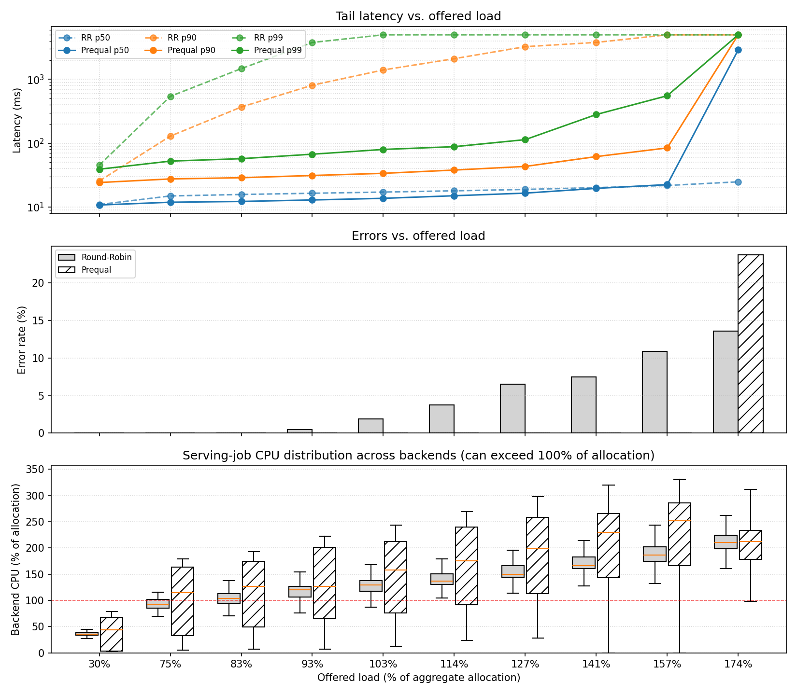
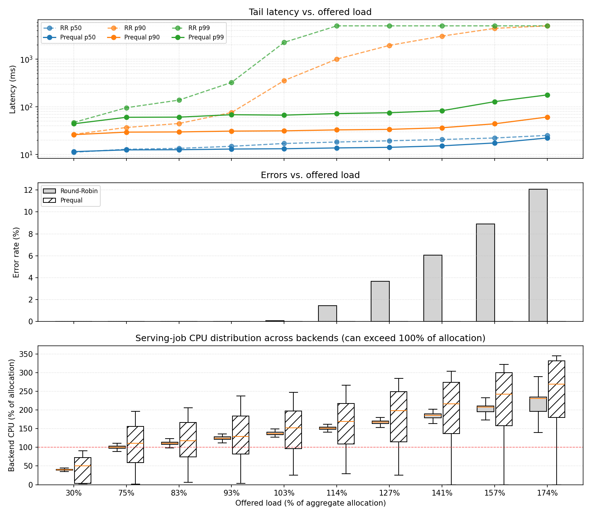

# Replicating: "Load is not what you should balance: Introducing Prequal"

**Team Members:**
Bahri Alabey (bahri.alabey@mail.polimi.it);
Furkan Bülbül (furkan.bulbul@mail.polimi.it)

---

**Source Paper:**
Bartek Wydrowski, Robert Kleinberg, Stephen M. Rumble, Aaron Archer: _Load is not what you should balance: Introducing Prequal_. In "21st USENIX Symposium on Networked Systems Design and Implementation (NSDI '24)", USENIX Association.

**Project:**
https://github.com/furknbulbul/prequal-nc — our Prequal implementation in Go, plus CloudLab deployment scripts, an experiment driver, and plotting scripts that reproduce every figure in this report.

---

# 1. Introduction

Large-scale services traditionally balance _load_: a router spreads queries so that every replica receives an equal share of work, typically weighting shares by CPU-utilization reports. The paper argues that this is the wrong objective. CPU utilization is a _stale, backward-looking_ signal — it tells you how busy a replica _was_, not how quickly it can serve the _next_ query. In multi-tenant clusters the problem is worse: antagonist jobs co-located on the same machine consume CPU unpredictably, so two replicas at the same reported utilization can have wildly different spare capacity. The result is that load-balanced systems still exhibit high tail latency and errors well before the fleet is actually saturated.

Prequal ("Probing to Reduce Queuing and Latency") replaces load balancing with _latency and queue balancing_, built on three key ideas:

1. **Real-time signals instead of utilization.** Each replica reports its current number of Requests-In-Flight (RIF) and an estimate of the latency a new request would experience.
2. **Asynchronous probing with a probe pool.** Rather than querying replicas synchronously on the critical path, the router sends a few probes per query (`r_probe`, typically 2–3) to randomly chosen replicas and keeps the responses in a small pool (capacity 16) with strict freshness rules: entries are reused a bounded number of times, removed after use, and expire quickly. This keeps the selection signal fresh at negligible cost.
3. **Hot-Cold Lexicographic (HCL) selection.** Replicas whose RIF exceeds the `Q_RIF` quantile (e.g. 0.84) of recently-seen RIF values are classified _hot_; the rest are _cold_. Among cold replicas the router picks the one with the lowest estimated latency; if all candidates are hot, it picks the lowest RIF. This avoids both queue build-up and herd behavior.

The main contributions are the Prequal algorithm itself, its deployment on YouTube's serving stack, and an evaluation showing large reductions in tail latency, error rates, RIF, and memory usage — while deliberately _unbalancing_ CPU: fast replicas are allowed to absorb far more work than slow ones, which is exactly the point of the title.

# 2. Selected Result

We reproduce the paper's **Figure 6**, the load-ramp experiment comparing Prequal against round-robin load balancing. In that experiment, offered load is increased step-wise from well below to well above 100% of the fleet's capacity, while antagonist processes create heterogeneous background load on the replicas. The paper shows that:

- with round-robin, tail latency (p90/p99) explodes and errors appear already around ~90–100% of capacity, because slow (antagonized) replicas receive the same share of queries as fast ones;
- with Prequal, median and tail latency stay nearly flat and the error rate stays at ~0 even when offered load significantly exceeds 100%, because queries are steered to replicas with spare capacity.

This is the central experimental claim of the paper — that balancing real-time signals (RIF, latency) instead of load lets a fleet run far beyond its nominal capacity without falling over — so it is the natural result to reproduce.

# 3. Environment Setup

**Hardware Environment:**

- CloudLab, **14 × m400** nodes (HPE Moonshot m400: 8-core 64-bit ARMv8 APM X-Gene at 2.4 GHz, 64 GB RAM, 120 GB SSD, 10 Gb NIC), all on one experiment LAN.
- Topology: **10 backend servers** (`srv-1..10`), **1 load generator** (`client-1`), **1 observer** (Prometheus + Grafana), **1 Round-Robin LB node** (`lb-rr-1`), **1 Prequal LB node** (`lb-prequal-1`). Keeping the two load balancers on separate, identical nodes ensures neither phase of the experiment is polluted by the other.

**Software Environment:**

- Ubuntu 22.04 (CloudLab image), Docker for all services, Go 1.24 for the load balancer and backend binaries.
- Load generator: **vegeta** in open-loop mode (constant request rate, 5 s per-request deadline). We initially used `hey`, but `hey` is closed-loop: it waits for responses before issuing new requests, so it _cannot_ hold a fixed offered load once the system slows down. vegeta keeps sending at the configured rate regardless of whether earlier requests have been answered, which is what an open-loop "offered load" experiment requires.
- Observer: Prometheus scraping every backend's `/metrics` every 5 s; Grafana dashboards for live inspection during runs.
- Antagonist: **stress-ng** running inside each backend container.
- **Paper artifact used: No.** Prequal is deployed inside Google and no artifact is published. We started from a third-party open-source Go load balancer, https://github.com/omarshaarawi/loadbalancer, as scaffolding (HTTP reverse proxy, server registry, RR baseline) and modified it heavily; the Prequal-relevant parts of that code base were insufficient and in places contradicted the paper, so most of the algorithm was written by us:
  - The reference computed **RIF and latency on the client (balancer) side**; this contradicts the paper, where replicas report their own signals. We moved both to the server side: each backend tracks its own in-flight counter and answers probes with its current RIF and a latency estimate (median over a ring of recent requests whose RIF-at-arrival was within ±2 of the current RIF).
  - There was **no per-query probe trigger**; we added it (`r_probe` probes fired on each query arrival, plus an idle floor of 10 probes/s so the pool never goes fully stale).
  - There was **no removal of probe-pool entries**; we added removal-after-use (`r_remove`) and TTL-based expiry.
  - We added a **reuse limit** for pool entries (max 3 uses), so the balancer does not keep sending traffic to the same "best" replica from one stale probe.
  - The backend's "CPU load" was **simulated with sleep-based delays**; we replaced it with real CPU-bound work (a SHA-256 hashing loop whose iteration count is drawn from a normal distribution, ≈10 ms median service time) so that queries actually contend for cores with the antagonist.
  - To estimate the RIF distribution for the `Q_RIF` hot/cold threshold, we added a **dedicated structure keeping a sliding time-window multiset of past probe-observed RIF values**, from which the quantile is computed (with a short-lived cache).

**Configuration Parameters:**

- Prequal: `r_probe = 3` probes per query (per-query probe mode), `Q_RIF = 0.84` over a 1 s RIF-observation window, probe-pool capacity 16, pool TTL 1 s, max probe reuse 3, probe removal after use (`r_remove = 1`), idle probe floor 10 probes/s, probe timeout 1 s, forward timeout 5 s.
- Backend workload: CPU-bound synthetic RPC as described above; antagonist: stress-ng burning **6 cores** per backend, duty-cycled (10 s period) with per-server phase offsets so that at any time a subset of the replicas is heavily antagonized — emulating the multi-tenant interference of the paper.
- Load levels: **30, 75, 83, 93, 103, 114, 127, 141, 157, 174 % of the calibrated capacity baseline**, **300 s per level**, run first against the RR LB and then against the Prequal LB. The 100% baseline is calibrated at the start of each experiment from a short low-rate run (20 s at 50 qps) that measures the median service time; for the run reported below the baseline was **1973 req/s**.

**Deviations from the Original Setup:**

- _Hardware/scale:_ the paper's testbed is Google-internal; we use 10 replicas on CloudLab m400 ARM nodes. All relative quantities (percent of baseline capacity) are preserved.
- _Baseline algorithm:_ our comparison uses plain **Round-Robin**.
- _Workload:_ the paper's testbed serves a real workload; we use a synthetic CPU-bound request with normally distributed work, since **the paper does not specify** a service-time distribution. The paper does not specify the client model either; we assumed an _open-loop_ client (see the debugging section — this assumption turned out to be essential).
- _Multi-tenancy:_ real co-located tenants are replaced by a phased stress-ng antagonist, following the spirit of the paper's antagonist experiments.

# 4. Experiment Result

**Execution procedure.**

1. `cloudlab/deploy.sh all` bootstraps all 14 nodes, builds the containers, and starts backends (with antagonists), both LBs, and the observer.
2. `cloudlab/experiment.sh` calibrates the baseline, then ramps through the ten load levels (300 s each) against the RR LB, pauses briefly, and repeats the identical ramp against the Prequal LB.
3. `cloudlab/plot_experiment.py` pulls per-backend CPU samples from the observer's Prometheus for each measurement window and renders the three-panel figure.

**Measurement method.** vegeta records every request; from its JSON report we take achieved throughput, p50/p90/p99 latency, and the error rate (non-2xx responses plus 5 s deadline hits). Backend CPU is measured by the backend itself via `getrusage` and exported as a Prometheus counter; the plotting script converts it to utilization as a 15 s rate, sampled every 5 s across each 300 s window (skipping the first 15 s of the window), for all 10 backends. Two properties of this metric matter for interpretation: it counts **only the serving process** (the stress-ng antagonist runs as separate processes), so differences between RR and Prequal reflect request placement, not antagonist activity; and it is normalized by a fixed per-backend reference (the same constant for every backend and level), so values above 100% simply mean the multi-core serving process used more than that reference share — the meaningful information is the comparison across algorithms and levels, not the absolute scale.

**Number of runs and statistical treatment.** One 300 s window per (algorithm, level) pair per experiment; the experiment was repeated several times during development with consistent results. We report two full runs with the same calibrated baseline: the static-probing run (`results/experiment/prequal`, analyzed in this section) and the adaptive-probing run (`results/experiment/adaptive-prequal`, analyzed in Section 5). Latency percentiles are computed by vegeta over all requests of a window (≈180 k at the 30% level up to ≈1 M at 174%). CPU statistics are the mean and standard deviation over ~600 samples per window (10 backends × ~60 scrapes).

**Correctness checks.** At every level we verified that achieved throughput matches the offered rate (open-loop sanity check — a shortfall means the system, not the generator, is the bottleneck); that at the 30% level both algorithms are statistically identical (they are: ~11 ms p50, 0% errors for both); and we cross-checked the client-side numbers against the LB's own Prometheus metrics (probe rate, pool occupancy, per-replica pick counts) on the Grafana dashboards.

## 4.1. Debugging journey

Getting a faithful reproduction required fixing several issues, each of which had silently flattered one side of the comparison:

1. **Closed-loop load generator.** Our first client (`hey`) only issues a new request when a previous one completes. When the server slows down, the client slows down with it, so the offered load silently drops exactly when the system is in trouble — which hides queueing collapse entirely; in our early closed-loop tests RR actually looked _better_ than Prequal. We replaced it with vegeta, which sends requests at the configured rate whether or not earlier requests have been answered (true open loop), with a 5 s deadline. This is what "offered load" on the x-axis of the paper's figure actually means.
2. **Probe-pool pathologies found via pick logging.** We added a ring buffer recording every pick the Prequal LB makes (`/debug/pool`) and analyzed the recorded picks. The analysis showed the balancer repeatedly hammering the same replica off a single stale probe entry — classic herd behavior. This is what led us to implement removal-after-use and the reuse limit on pool entries; after that, the pick distribution matched the paper's intended behavior.
3. **Weak antagonist.** With a token background load, all replicas were equally fast and RR had nothing to lose. The phased 6-core stress-ng antagonist recreates the heterogeneity that Prequal is designed to exploit.

Throughout, the Grafana dashboards on the observer (per-replica RIF, probe rates, CPU, pick counts in real time) were the main debugging instrument — most of the issues above were first _seen_ on a dashboard before being confirmed in the data.

## 4.2. Results

  
  
Figure 1: Our reproduction of the paper's Figure 6 (static r_probe = 3). Top: latency percentiles (log scale). Middle: error rate. Bottom: distribution of per-backend serving CPU across the 10 replicas (normalized; values above 100% are expected).

Full numbers for the run (`results/experiment/prequal`, baseline = 1973 qps):

| Load | Target qps | RR p50 (ms) | RR p90 (ms) | RR p99 (ms) | RR err % | PQ p50 (ms) | PQ p90 (ms) | PQ p99 (ms) |  PQ err % |
| ---: | ---------: | ----------: | ----------: | ----------: | -------: | ----------: | ----------: | ----------: | --------: |
|  30% |        592 |        10.9 |        25.5 |          45 |     0.00 |        10.7 |        24.1 |          39 |      0.00 |
|  75% |       1480 |        14.9 |         129 |         542 |     0.00 |        11.8 |        27.5 |          52 |      0.00 |
|  83% |       1638 |        15.7 |         369 |        1475 |     0.00 |        12.2 |        28.7 |          57 |      0.00 |
|  93% |       1836 |        16.4 |         810 |        3791 |     0.46 |        12.9 |        31.1 |          67 |      0.00 |
| 103% |       2033 |        17.1 |        1406 |        5000 |     1.89 |        13.6 |        33.7 |          80 |      0.00 |
| 114% |       2250 |        17.9 |        2112 |        5001 |     3.72 |        15.0 |        37.9 |          88 |      0.00 |
| 127% |       2507 |        18.8 |        3260 |        5001 |     6.52 |        16.5 |        43.2 |         114 |      0.00 |
| 141% |       2783 |        20.1 |        3801 |        5001 |     7.46 |        19.5 |        61.6 |         281 |      0.00 |
| 157% |       3099 |        21.7 |        5000 |        5001 |    10.85 |        22.4 |        84.2 |         554 |      0.00 |
| 174% |       3435 |        24.8 |        5000 |        5001 |    13.60 |    **2901** |        5000 |        5001 | **23.71** |

Per-backend serving CPU (normalized %), mean ± standard deviation over the 10 replicas within each window:

| Load | RR CPU mean ± std | Prequal CPU mean ± std |
| ---: | ----------------: | ---------------------: |
|  30% |        36.2 ± 3.1 |            37.4 ± 29.4 |
|  75% |        93.5 ± 9.0 |            97.5 ± 63.2 |
|  83% |      103.1 ± 12.5 |           109.5 ± 63.4 |
|  93% |      116.7 ± 14.0 |           126.0 ± 68.3 |
| 103% |      127.2 ± 17.9 |           143.3 ± 68.2 |
| 114% |      136.8 ± 24.8 |           163.4 ± 73.0 |
| 127% |      149.5 ± 28.7 |           183.6 ± 73.7 |
| 141% |      164.4 ± 30.6 |           201.5 ± 72.8 |
| 157% |      179.0 ± 40.7 |           219.4 ± 74.5 |
| 174% |      195.5 ± 51.8 |       **203.7 ± 44.0** |

**Tail latency: RR vs Prequal in detail.** The tail is where the two algorithms separate, and they separate early:

- **The medians barely differ; the tails differ by orders of magnitude.** Even at 157% load, RR's p50 is only 21.7 ms against Prequal's 22.4 ms — by the median alone the two systems look interchangeable. But at the same level RR's p99 is pinned at the 5 s deadline while Prequal's is 554 ms, and RR's p90 is 5000 ms against Prequal's 84 ms — a ~60× gap. This is precisely the paper's argument for why _load_ (and average behavior generally) is the wrong lens: RR keeps every replica equally loaded, and most requests — those landing on momentarily un-antagonized replicas — are served promptly, which keeps the median flat. The requests that land on an antagonized replica, however, join a queue that RR keeps feeding at full rate, and those requests make up the exploding tail.
- **RR's tail degrades long before nominal saturation.** At 75% of capacity RR's p99 is already 542 ms (10× Prequal's 52 ms); at 83% it is 1475 ms (26×); at 93% it reaches 3791 ms (57×) and the first errors appear (0.46%). From 103% onward RR's p99 sits at the 5 s deadline, its p90 follows by 157%, and errors climb monotonically to 13.6% at 174% — every one of those errors is a request that waited out its whole 5 s deadline in a queue.
- **Prequal's tail grows gracefully.** Prequal's p99 stays under 100 ms through 114% of capacity and reaches only 554 ms at 157% — still below RR's p99 _at 75%_. Its p90 stays in the tens of milliseconds throughout. It serves **zero errors** at every level through 157%, i.e. well past the point where the fleet is nominally saturated. The HCL rule is doing exactly what the paper claims: probes identify the currently-antagonized (hot) replicas, and queries flow around them.
- **The exception is the final level.** At **174%**, our static-`r_probe` Prequal collapsed harder than RR: 23.7% errors, a 2.9 s median, and only 2419 of 3435 offered qps served. The CPU table pinpoints _where_ the collapse happened — and where it did not: Prequal's mean backend CPU _dropped_ from 219 to 204 even though offered load rose. The backends were not overwhelmed; they were _starved_. The congested component was the load balancer itself: requests piled up inside it faster than it could forward them, so work never reached the servers at the offered rate. The backends' CPU fell because they genuinely could not get work to do, while requests timed out waiting inside the balancer. The problem is not full CPUs — it is a full balancer. Section 5 analyzes and addresses this.

**Why Prequal's CPU standard deviation is so much higher.** The CPU table shows RR with a tight distribution (±3 to ±52) and Prequal with a wide one (±29 to ±75). The difference is not noise; it is a direct picture of how each algorithm distributes requests. RR, by definition, gives every replica an identical share of the traffic, regardless of what state that replica is in — so all ten serving processes burn roughly the same CPU, and the standard deviation stays small. That uniformity is exactly RR's weakness: an antagonized replica receives just as many queries as a fast one, cannot keep up, and its queue produces the tail latencies and errors seen above. Prequal makes the opposite trade. Its probes continuously discover which replicas the antagonist is currently squeezing, and HCL routes queries around them: at any instant, a few un-antagonized replicas are running far above the fleet average while the antagonized ones serve almost nothing. A snapshot across the ten backends therefore shows a large spread — and that spread is present from the very first load level (±29 already at 30% load, where nothing is saturated), confirming it comes from placement, not from stress. In other words, the high standard deviation is the mechanism working as intended: Prequal deliberately unbalances _CPU_ so that no query ever has to wait behind a struggling replica — it trades balanced utilization for balanced _waiting time_, which is literally the paper's title.

**Comparison with the paper.** Up to 157% of capacity our results reproduce the paper's Figure 6 qualitatively and, in trend, quantitatively: near-flat Prequal latency and ~0 errors beyond nominal saturation, RR tail collapse from ~90% onward, and Prequal's characteristic CPU imbalance. The 174% collapse of static-`r_probe` Prequal is a divergence from the paper (which does not report balancer-side overload) and motivated the feature we built in Section 5, where the head-to-head comparison of static vs adaptive probing shows the collapse eliminated.

# 5. Further Exploration

We took option 2: **we implemented a new feature — adaptive `r_probe` — on top of our Prequal implementation.**

**Motivation.** The 174% anomaly above is _probe overload_: past a load threshold, the balancer's own probing traffic consumes the resources it needs to do its actual job. With static `r_probe = 3`, every arriving query fires three probe RPCs, so at 3435 qps the balancer is issuing, awaiting, and processing over ten thousand probes per second on top of forwarding the queries themselves. Below the threshold this overhead is absorbed without visible cost. Above it, probe handling occupies so much of the balancer that it can no longer forward queries at the offered rate: requests pile up in the balancer's queue and expire there, while probes keep arriving at full force — their rate is dictated by the query rate, not by whether the balancer can afford them. This is also exactly why the measured backend CPU is _low_ during the collapse: the servers are not busy, they are starved, because the clogged balancer cannot push work out to them fast enough. And the probes bought nothing in return — probing exists to locate spare capacity, and with every replica saturated there is none to locate, so at this operating point probing is pure cost. The fix is therefore not more balancer capacity but restraint: the probe rate should back off when the balancer itself is congested. The paper does not discuss balancer-side overload of the probing mechanism, so this is a genuine robustness gap worth exploring.

**The feature.** We make the probe rate a decreasing function of balancer pressure, measured as the number of in-flight forwarded requests `F` at the LB:

- `F ≤ L` (low watermark, default 100): use the full `r_max = 3`;
- `F ≥ H` (high watermark, default 1000): drop to the floor `r_min = 1`;
- in between, interpolate linearly: `r = r_max − (F − L)/(H − L) · (r_max − r_min)`.

Within the `[L, H]` interval the balancer thus sheds probe load exactly in proportion to how congested it is, which resolves the overload: fewer probes per query free the balancer to forward queries again → the queue drains → `F` falls → the probe rate recovers on its own. The idle-probe floor (10 probes/s) still guarantees the pool never goes completely stale. The feature is enabled per experiment with `experiment.sh -A 1` (flags `-N/-L/-H` set `r_min`, `L`, `H`), so adaptive and static runs use identical binaries and topology.

## 5.1. Methodology and Result

We ran the identical ten-level ramp (30–174%, 300 s per level) twice — once with static `r_probe = 3` (Section 4.2, `results/experiment/prequal`) and once with adaptive probing enabled (`results/experiment/adaptive-prequal`) — and compare Prequal against itself. Both runs use the same calibrated baseline (1973 req/s), so every level offers the same absolute request rate and the two runs are directly comparable. RR is unaffected by the feature and ran in both experiments as a sanity control; its run-to-run differences (e.g. 10.9% vs 8.9% errors at 157%) give a sense of the natural variance between experiments. Measurement and statistics are exactly as in Section 4.

Our hypothesis, given the analysis above: adaptive probing should leave the low levels untouched, remove the 174% collapse, and at worst cost a mild latency increase at high load from a staler probe pool.

  
  
Figure 2: The same experiment as Figure 1, with adaptive r_probe. The Prequal collapse at 174% is gone: latency stays low, errors stay at zero, and backend CPU keeps climbing through the last level instead of dropping.

Prequal head-to-head, static vs adaptive (same target qps per level; RR columns omitted — see Figure 1/2):

| Load | p50 static | p50 adaptive | p90 static | p90 adaptive | p99 static | p99 adaptive | err % static | err % adaptive |
| ---: | ---------: | -----------: | ---------: | -----------: | ---------: | -----------: | -----------: | -------------: |
|  30% |       10.7 |         11.5 |       24.1 |         26.1 |         39 |           44 |         0.00 |           0.00 |
|  75% |       11.8 |         12.5 |       27.5 |         29.5 |         52 |           60 |         0.00 |           0.00 |
|  83% |       12.2 |         12.6 |       28.7 |         29.8 |         57 |           61 |         0.00 |           0.00 |
|  93% |       12.9 |         13.0 |       31.1 |         30.9 |         67 |           68 |         0.00 |           0.00 |
| 103% |       13.6 |         13.2 |       33.7 |         31.4 |         80 |           67 |         0.00 |           0.00 |
| 114% |       15.0 |         13.7 |       37.9 |         32.8 |         88 |           72 |         0.00 |           0.00 |
| 127% |       16.5 |         14.1 |       43.2 |         33.7 |        114 |           75 |         0.00 |           0.00 |
| 141% |       19.5 |         15.2 |       61.6 |         36.4 |        281 |           83 |         0.00 |           0.00 |
| 157% |       22.4 |         17.5 |       84.2 |         44.1 |        554 |          129 |         0.00 |           0.00 |
| 174% |   **2901** |     **22.3** |       5000 |         61.1 |       5001 |          178 |    **23.71** |       **0.00** |

Prequal per-backend serving CPU (normalized %), mean ± std, static vs adaptive:

| Load | Static run | Adaptive run |
| ---: | ---------------: | ---------------: |
|  30% |      37.4 ± 29.4 |      42.4 ± 32.2 |
|  75% |      97.5 ± 63.2 |     106.1 ± 56.9 |
|  83% |     109.5 ± 63.4 |     117.2 ± 54.3 |
|  93% |     126.0 ± 68.3 |     132.0 ± 58.8 |
| 103% |     143.3 ± 68.2 |     147.1 ± 57.2 |
| 114% |     163.4 ± 73.0 |     162.5 ± 61.0 |
| 127% |     183.6 ± 73.7 |     181.5 ± 69.5 |
| 141% |     201.5 ± 72.8 |     197.9 ± 77.9 |
| 157% |     219.4 ± 74.5 |     219.5 ± 82.1 |
| 174% | **203.7 ± 44.0** | **243.7 ± 87.7** |

**What we discovered.**

- **The collapse is eliminated.** At 174%, adaptive Prequal served 3434 of the 3435 offered qps with **0% errors**, a 22.3 ms median, and a 178 ms p99 — against static's 23.71% errors, 2.9 s median, and 30% throughput shortfall at the same offered rate. Adaptive Prequal at 174% is even better than static Prequal was at 157% (p99 178 ms vs 554 ms).
- **The CPU column confirms the diagnosis.** In the static run, mean backend CPU _fell_ from 219 to 204 at the final level — the starved-backend signature of a clogged balancer. In the adaptive run it keeps _rising_, from 220 to 244: with the probe rate backed off, the balancer forwards at the full offered rate and the servers finally receive the work. The collapse really was balancer-side, and shedding probes fixes exactly that.
- **Everything below the threshold is unchanged (or slightly better).** Errors are zero at every level in both runs below 174%. The adaptive run's latencies at 103–157% are modestly better than static's (e.g. p99 129 vs 554 ms at 157%), but the RR control improved by a similar margin between the two runs, so we attribute most of that gap to run-to-run variance rather than to the feature; the honest claim is "no worse, possibly slightly better".
- **The feared staleness penalty did not materialize.** We hypothesized a mild latency cost from a staler probe pool at high load; there is none visible. With 10 replicas, even a reduced probe rate keeps the pool fresh enough — and the idle floor guarantees a minimum signal. The asymmetry is stark: reducing probes costs approximately nothing, while not reducing them costs a total collapse.

# 6. Reproducibility Assessment of the Paper

- **Methodology clarity.** The algorithm itself is described well at the conceptual level: the paper gives concrete values for essentially every Prequal parameter (`r_probe = 3`, `Q_RIF = 0.84`, pool size 16, reuse and removal policies), which we could translate into code almost mechanically. The _experimental_ methodology of Figure 6 is much thinner: the service-time distribution, the client model (open vs closed loop), and the antagonist behavior are not specified. Each of these turned out to be load-bearing — most of our debugging episodes (Section 4.1) were about recovering an unstated assumption.
- **Artifact usability.** There is no official artifact; Prequal is a closed-source production system inside Google. We started from a third-party open-source load balancer as scaffolding, but as a reference for Prequal it was very insufficient — and in places arguably _wrong_: it computed RIF and latency on the client/balancer side, the opposite of the paper's replica-reported signals, and it lacked per-query probing, pool-entry removal, and reuse limits entirely. In practice most Prequal features had to be written from scratch, guided only by the paper's prose.
- **Reproduction difficulty.** High. Implementing the algorithm was itself a substantial effort: with no artifact and a reference code base that was insufficient and partly incorrect, most of Prequal's machinery — server-side RIF and latency reporting, per-query probe triggering, pool-entry removal and reuse limits, the RIF-distribution estimator behind the hot/cold threshold — had to be designed and built by us from the paper's prose (the details are in Section 3). On top of that came the testbed work needed to make the comparison fair and meaningful: open-loop load generation, realistic phased antagonists, and pick-log-driven debugging of the probe-pool dynamics. The headline result reproduces robustly once both layers are right, which speaks well of the paper — the effect is large and not an artifact of tuning.

# 7. Conclusion

We reproduced the central result of _Prequal_ (NSDI '24) on a 14-node CloudLab m400 cluster, running the full load ramp from 30% up to **174%** of the fleet's calibrated capacity. Our Prequal implementation held median latency nearly flat, kept p90/p99 one to two orders of magnitude below Round-Robin from 75% load onward (e.g. 84 ms vs 5000 ms p90 at 157%), and served zero errors through 157% of capacity, while RR's tail hit the 5 s deadline from 103% and its error rate climbed to 13.6%. It achieved this precisely by _unbalancing_ CPU across replicas — Prequal's per-backend CPU standard deviation was consistently 2–8× RR's, because it concentrates work on whichever replicas the antagonist is currently leaving alone — confirming the paper's thesis that load is not what you should balance.

The ramp's final level also exposed a failure mode the paper does not report: at 174%, the fixed per-query probe rate overloads the balancer itself — probe handling consumes the resources needed for forwarding, so backend CPU drops because work can no longer reach the servers, while nearly a quarter of requests time out inside the balancer's queue. Our adaptive `r_probe`, which sheds probe load in proportion to the balancer's in-flight count between two watermarks, eliminates this failure completely: rerunning the identical ramp, adaptive Prequal served the full offered rate at 174% with 0% errors and a 178 ms p99 (vs 23.7% errors and a 2.9 s median with static probing), while backend CPU kept climbing to 244% instead of dropping — the work finally reached the servers. Below the overload threshold the feature costs nothing measurable. The two takeaways compose neatly: real-time-signal balancing works as advertised, and its one self-inflicted overhead — probing — should itself adapt to load.
